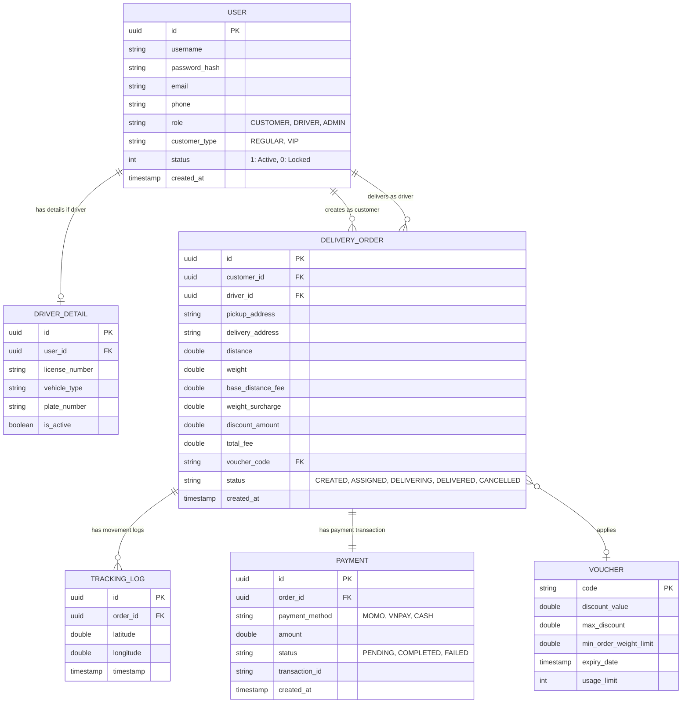

# BÁO CÁO HACKATHON MÔN AI APPLICATION IN ACTION
## ĐỀ 001 - GIỮA MÔN

* **Họ và tên:** Nguyễn Tiến Thành
* **Lớp:** HN-K24-CNTT3
* **Mã đề:** Đề 001
* **Repository:** HN-K24-CNTT3_NguyenTienThanh_001

---

## PHẦN 1: TÁI CẤU TRÚC HỆ THỐNG ĐỂ DỄ MỞ RỘNG (OCP)

### 1. Mục tiêu kỹ thuật
* **Kiến trúc áp dụng**: Áp dụng nguyên lý thiết kế **Open/Closed Principle (OCP)** và **Single Responsibility Principle (SRP)** trong SOLID kết hợp với **Strategy Pattern** và **Dependency Injection (DI)** của Spring.
* **Giải pháp**: 
  - Tái cấu trúc toàn bộ mã nguồn xử lý checkout vào một tệp duy nhất là [OrderService.java](file:///e:/BaiTap/IT212_UngDungAI/HN-K24-CNTT3_NguyenTienThanh_001/src/refactoring/OrderService.java) để đơn giản hóa cấu trúc thư mục nộp bài.
  - Định nghĩa interface `VoucherStrategy` và các class triển khai cụ thể (`VipVoucherStrategy`, `FreeshipVoucherStrategy`) cho việc tính toán mã giảm giá.
  - Định nghĩa interface `PaymentProcessor` và các class triển khai cụ thể (`MomoPaymentProcessor`, `VnPayPaymentProcessor`) cho việc kết nối cổng thanh toán.
  - Định nghĩa interface `NotificationService` và các class triển khai cụ thể (`EmailNotificationService`, `SmsNotificationService`) cho việc gửi thông báo.
  - Lớp `OrderService` lõi nhận danh sách các strategy này qua Constructor Injection và điều phối thực thi. Khi cần thêm loại voucher mới, cổng thanh toán mới, hoặc chuyển đổi từ email sang SMS, ta chỉ cần viết thêm class mới triển khai interface tương ứng mà hoàn toàn không cần sửa đổi mã nguồn phương thức `checkout` chính của `OrderService`.

### 2. Lịch sử Prompt (Prompt Chain)
* **Prompt 1**:
  > *"Tôi có một hàm checkout trong OrderService viết bằng Java nhận đầu vào là Cart, User, paymentMethod, và voucherCode. Hiện tại hàm này đang dùng if-else lồng nhau để kiểm tra loại voucher (VIP, FREESHIP), cổng thanh toán (MOMO, VNPAY) và gửi email thông báo. Đoạn code này đang vi phạm nguyên lý SOLID nào? Hãy phân tích chi tiết."*
* **Prompt 2**:
  > *"Hãy đề xuất cách tái cấu trúc đoạn code trên sử dụng Strategy Pattern để tuân thủ nguyên lý Open/Closed Principle (OCP). Tôi cần tách biệt các phần Voucher, Payment và Notification. Hãy viết các interface và các class triển khai mẫu bằng ngôn ngữ Java."*
* **Prompt 3**:
  > *"Hãy hoàn thiện class OrderService sau khi tái cấu trúc. Lớp này phải nhận danh sách các VoucherStrategy và PaymentProcessor thông qua dependency injection (Constructor) để tự động chọn bộ xử lý phù hợp dựa trên mã voucher và phương thức thanh toán."*

### 3. Phân tích lỗi AI
* **Điểm AI làm chưa tối ưu ở lần sinh code đầu tiên**:
  Trong phiên bản sinh code đầu tiên cho `VoucherStrategy`, AI đã thiết kế interface như sau:
  ```java
  public interface VoucherStrategy {
      double apply(double total);
  }
  ```
  Và định cấu hình map tĩnh hoặc truyền cứng loại voucher. Việc này dẫn đến việc không thể kiểm tra điều kiện áp dụng động của voucher dựa trên mã `voucherCode` thực tế (như kiểm tra tiền tố `"VIP"`, `"FREESHIP"` hoặc các quy tắc nghiệp vụ phức tạp đi kèm).
* **Cách khắc phục**:
  Tôi đã yêu cầu AI bổ sung phương thức kiểm tra điều kiện áp dụng trực tiếp vào Interface:
  ```java
  public interface VoucherStrategy {
      boolean isApplicable(String voucherCode);
      double apply(double total, String voucherCode);
  }
  ```
  Nhờ đó, `OrderService` có thể duyệt qua danh sách các chiến lược được inject vào hệ thống, tự động kích hoạt chiến lược phù hợp dựa trên mã code mà không cần cấu hình map cứng.

---

## PHẦN 2: DEBUGGING BẢO MẬT VÀ XỬ LÝ LỖI HỆ THỐNG

### 1. Phân tích lỗi (Root Cause)
* **Nguyên nhân gốc rễ**: 
  Khi JWT hết hạn, thư viện `jsonwebtoken` ném ra ngoại lệ `ExpiredJwtException` bên trong hàm `doFilterInternal` của `JwtAuthenticationFilter`. 
  Vì Filter (Bộ lọc Security) nằm ngoài chuỗi xử lý của Spring MVC (DispatcherServlet), các ngoại lệ ném ra tại đây sẽ không được bắt bởi cơ chế xử lý lỗi tập trung thông thường của Spring MVC là `@RestControllerAdvice` hay `@ExceptionHandler`. 
  Do không được bắt, ngoại lệ này tiếp tục bị ném lên Servlet Container (Tomcat) và dẫn đến lỗi crash hệ thống với mã lỗi HTTP 500 Internal Server Error thay vì trả về HTTP 401 Unauthorized kèm thông tin chi tiết.

### 2. Lịch sử Prompt (Prompt Chain)
* **Prompt 1**:
  > *"Hệ thống Spring Boot của tôi bị crash trả về lỗi HTTP 500 khi JWT Token hết hạn do ExpiredJwtException ném ra trong filter JwtAuthenticationFilter. Tại sao `@RestControllerAdvice` của tôi không bắt được lỗi này? Hãy giải thích luồng hoạt động của Security Filter Chain."*
* **Prompt 2**:
  > *"Làm thế nào để bắt lỗi ExpiredJwtException và trả về phản hồi JSON đồng nhất dạng `{"error": "AUTH_FAILED", "message": "..."}` với HTTP Status 401 tập trung ở tầng cao nhất của ứng dụng? Hãy đề xuất giải pháp tốt nhất mà không cần viết try-catch trực tiếp trong hàm Filter xác thực."*
* **Prompt 3**:
  > *"Hãy cung cấp mã nguồn chi tiết cho ExceptionHandlerFilter và cách đăng ký nó trong SecurityConfig để bộ lọc này hoạt động trước JwtAuthenticationFilter."*

### 3. Phân tích lỗi AI
* **Điểm AI làm chưa tối ưu ở lần sinh code đầu tiên**:
  AI đề xuất giải pháp viết trực tiếp khối `try-catch` bao quanh toàn bộ logic của hàm `doFilterInternal` trong `JwtAuthenticationFilter` và tự ghi phản hồi (write response) thủ công bằng `ObjectMapper`.
* **Cách khắc phục**:
  Tôi đã phản biện rằng cách này vi phạm nguyên tắc Single Responsibility (SRP), khiến filter xác thực phải đảm nhận thêm vai trò định dạng lỗi và ghi phản hồi HTTP. Thay vào đó, tôi yêu cầu thiết kế một **ExceptionHandlerFilter** riêng biệt đặt ở đầu chuỗi filter (`addFilterBefore` của Spring Security). 
  `ExceptionHandlerFilter` sẽ bắt mọi lỗi ném ra từ các filter phía sau và xử lý trả về JSON định dạng chuẩn hóa, giúp tách biệt hoàn toàn logic nghiệp vụ bảo mật và logic xử lý lỗi giao diện API.

### 4. Giải pháp thực thi & So sánh thiết kế
* **Mã nguồn giải pháp**:
  - Bộ lọc lỗi tập trung: [ExceptionHandlerFilter.java](file:///e:/BaiTap/IT212_UngDungAI/HN-K24-CNTT3_NguyenTienThanh_001/src/security/ExceptionHandlerFilter.java)
  - Bộ lọc xác thực: [JwtAuthenticationFilter.java](file:///e:/BaiTap/IT212_UngDungAI/HN-K24-CNTT3_NguyenTienThanh_001/src/security/JwtAuthenticationFilter.java)
  - Cấu hình chuỗi bảo mật: [SecurityConfig.java](file:///e:/BaiTap/IT212_UngDungAI/HN-K24-CNTT3_NguyenTienThanh_001/src/security/SecurityConfig.java)
* **Tại sao không nên dùng try-catch đơn thuần bên trong hàm Filter**:
  1. **Tính cô lập & SRP (Single Responsibility)**: Mỗi Filter chỉ nên thực hiện một nhiệm vụ duy nhất. `JwtAuthenticationFilter` chỉ lo việc trích xuất và xác thực token. Việc ghi mã phản hồi JSON lỗi trực tiếp trong filter này sẽ làm phình to code và khó bảo trì.
  2. **Tính tập trung (Centralization)**: Hệ thống có thể có nhiều filter xác thực khác nhau (ví dụ: xác thực bằng API Key, OAuth2, Basic Auth). Nếu dùng try-catch đơn thuần, ta phải viết lại logic xử lý lỗi và định dạng JSON phản hồi cho từng filter. Dùng `ExceptionHandlerFilter` ở đầu chuỗi giúp bắt tập trung toàn bộ các ngoại lệ bảo mật của ứng dụng một cách đồng nhất.
  3. **Khả năng tái sử dụng & Dễ mở rộng**: Khi cần thay đổi cấu trúc JSON phản hồi lỗi của toàn hệ thống, ta chỉ cần chỉnh sửa tại một nơi duy nhất là `ExceptionHandlerFilter` thay vì phải rà soát sửa đổi nhiều file filter khác nhau.

---

## PHẦN 3: PHÂN TÍCH VÀ THIẾT KẾ HỆ THỐNG VỚI AI (Rikkei Logistics)

### Nhiệm vụ 1: Đề xuất Giải pháp Công nghệ (Tech Stack)

#### A. Prompt yêu cầu AI đề xuất Tech Stack:
> *"Tôi là một Chuyên viên phân tích hệ thống (System Analyst). Khách hàng muốn xây dựng hệ thống 'Rikkei Logistics' gồm App Mobile (cho khách hàng và tài xế), và Web Admin (cho điều phối viên). Nghiệp vụ gồm quản lý người dùng (Khách hàng thường/VIP, tài xế, admin), tính phí giao hàng phức tạp theo quãng đường, trọng lượng và giảm giá, cùng với tính năng theo dõi đơn hàng thời gian thực (realtime tracking). Hãy đề xuất một bộ Tech Stack đầy đủ (Frontend, Backend, Database, Realtime, Infrastructure) kèm lý do thuyết phục để tôi trình bày với khách hàng."*

#### B. Tóm tắt giải pháp công nghệ đề xuất:
1. **Frontend**:
   - **Mobile App (Khách hàng & Tài xế)**: **Flutter** (Dart) - Hỗ trợ đa nền tảng (iOS & Android) từ một codebase, hiệu năng mượt mà gần native, giao diện phong phú và phát triển nhanh chóng.
   - **Web Admin (Điều phối viên)**: **React.js** (TypeScript) + **TailwindCSS** - Phát triển giao diện quản lý nhanh, hệ sinh thái component đa dạng (Ant Design/MUI), quản lý state tốt (Redux Toolkit) phù hợp cho trang Dashboard điều phối.
2. **Backend**:
   - **Spring Boot (Java)**: Đảm nhận phần API nghiệp vụ chính (Quản lý User, tính toán chi phí, xử lý thanh toán, lưu đơn hàng). Mạnh mẽ, ổn định, bảo mật cực tốt nhờ Spring Security và dễ dàng mở rộng.
   - **Node.js (NestJS)**: Làm Gateway hoặc Microservice nhỏ chuyên xử lý realtime tracking và kết nối Socket. Node.js xử lý I/O bất đồng bộ cực tốt, nhẹ và tiết kiệm tài nguyên khi có hàng vạn kết nối đồng thời từ tài xế.
3. **Database**:
   - **PostgreSQL**: Cơ sở dữ liệu quan hệ chính để lưu trữ thông tin giao dịch, User, Đơn hàng. PostgreSQL hỗ trợ cực tốt phần dữ liệu không gian địa lý thông qua extension **PostGIS** (rất quan trọng để tính toán khoảng cách tọa độ GPS của tài xế và khách hàng).
   - **Redis**: Lưu trữ bộ nhớ đệm (Caching) cho các cấu hình tính phí, phiên đăng nhập, và làm Message Broker hoặc lưu trữ vị trí tài xế tạm thời trước khi đồng bộ về PostgreSQL.
4. **Realtime Communication**:
   - **Socket.io (WebSocket)**: Đảm bảo cập nhật vị trí tọa độ tài xế lên bản đồ của khách hàng theo thời gian thực (Real-time tracking).
5. **Infrastructure & Cloud**:
   - **Docker & Kubernetes**: Container hóa các dịch vụ để dễ deploy và mở rộng tự động.
   - **AWS (Amazon Web Services)**: Sử dụng các dịch vụ AWS EC2, Amazon RDS, S3 để lưu hình ảnh hóa đơn/hàng hóa và AWS SNS/SES gửi thông báo.

#### C. Lý do của khách hàng và nhận xét phản biện:
* **Ý kiến phản biện của Khách hàng**: 
  Khách hàng thắc mắc tại sao không dùng toàn bộ bằng một ngôn ngữ duy nhất cho Backend (ví dụ chỉ dùng Node.js hoặc chỉ dùng Spring Boot) để dễ quản lý nhân sự, mà lại đề xuất kết hợp cả Java Spring Boot và Node.js?
* **Nhận xét & Biện hộ của tôi (Đồng ý với đề xuất của AI)**:
  Tôi **đồng ý hoàn toàn** với giải pháp kết hợp này vì tính chất đặc thù của hệ thống Logistics:
  - **Spring Boot** cực kỳ mạnh mẽ trong xử lý các nghiệp vụ tài chính, tính phí giao hàng phức tạp, quản lý phân quyền chặt chẽ. Hệ thống Spring Boot giúp đảm bảo tính toàn vẹn của dữ liệu giao dịch đơn hàng và tính phí một cách nhất quán.
  - **Node.js (NestJS)** lại có lợi thế tuyệt đối về khả năng xử lý hàng triệu kết nối WebSocket đồng thời với chi phí tài nguyên phần cứng cực thấp. Nếu đưa phần WebSocket realtime tracking vào Spring Boot, nó có thể làm nghẽn luồng xử lý của các API tài chính quan trọng khác khi lượng tài xế tăng cao. 
  - Việc tách biệt thành 2 service này giúp hệ thống đạt hiệu năng tối ưu, đồng thời dễ dàng scale độc lập (khi lượng tài xế online nhiều chỉ cần scale Node.js service).

---

### Nhiệm vụ 2: Phân tích Thực thể (Entity Analysis)

#### A. Prompt yêu cầu AI phân tích thực thể:
> *"Với các nghiệp vụ lõi của Rikkei Logistics bao gồm: quản lý người dùng (role Khách hàng, Tài xế, Admin, quyền VIP), tính phí giao hàng phức tạp (quãng đường, phụ phí trọng lượng, đặc quyền VIP, voucher), và theo dõi realtime. Hãy giúp tôi xác định danh sách các thực thể (Entities) cốt lõi của cơ sở dữ liệu kèm các thuộc tính quan trọng của chúng."*

#### B. Danh sách thực thể (Entities) cốt lõi:

1. **User (Người dùng)**
   - `id` (Primary Key - UUID)
   - `username` (String)
   - `password_hash` (String)
   - `email` (String)
   - `phone` (String)
   - `role` (Enum: CUSTOMER, DRIVER, ADMIN)
   - `customer_type` (Enum: REGULAR, VIP) - Áp dụng cho Customer
   - `status` (Int: 1 = Active, 0 = Locked)
   - `created_at` (Timestamp)

2. **DriverDetail (Chi tiết tài xế)**
   - `id` (Primary Key - UUID)
   - `user_id` (Foreign Key -> User.id)
   - `license_number` (String)
   - `vehicle_type` (String)
   - `plate_number` (String)
   - `is_active` (Boolean) - Trạng thái sẵn sàng nhận đơn

3. **DeliveryOrder (Đơn hàng giao)**
   - `id` (Primary Key - UUID)
   - `customer_id` (Foreign Key -> User.id)
   - `driver_id` (Foreign Key -> User.id, nullable)
   - `pickup_address` (String)
   - `delivery_address` (String)
   - `distance` (Double) - Quãng đường tính bằng km
   - `weight` (Double) - Trọng lượng tính bằng kg
   - `base_distance_fee` (Double) - Phí quãng đường gốc
   - `weight_surcharge` (Double) - Phụ phí trọng lượng
   - `discount_amount` (Double) - Số tiền giảm giá từ voucher hoặc ưu đãi VIP
   - `total_fee` (Double) - Tổng phí cuối cùng khách phải trả
   - `voucher_code` (String, nullable)
   - `status` (Enum: CREATED, ASSIGNED, PICKED_UP, DELIVERING, DELIVERED, CANCELLED)
   - `created_at` (Timestamp)

4. **Voucher (Mã giảm giá)**
   - `code` (Primary Key - String)
   - `discount_value` (Double)
   - `max_discount` (Double)
   - `min_order_weight_limit` (Double) - Điều kiện hàng cồng kềnh (> 30kg thì không áp dụng)
   - `expiry_date` (Timestamp)
   - `usage_limit` (Int)

5. **TrackingLog (Lịch sử hành trình realtime)**
   - `id` (Primary Key - UUID)
   - `order_id` (Foreign Key -> DeliveryOrder.id)
   - `latitude` (Double)
   - `longitude` (Double)
   - `timestamp` (Timestamp)

6. **Payment (Thanh toán)**
   - `id` (Primary Key - UUID)
   - `order_id` (Foreign Key -> DeliveryOrder.id)
   - `payment_method` (Enum: MOMO, VNPAY, CASH)
   - `amount` (Double)
   - `status` (Enum: PENDING, COMPLETED, FAILED)
   - `transaction_id` (String)
   - `created_at` (Timestamp)

---

### Nhiệm vụ 3: Thiết kế Sơ đồ quan hệ thực thể (ERD)

#### A. Prompt yêu cầu AI tạo mã Mermaid ERD:
> *"Dựa trên danh sách các thực thể ở Nhiệm vụ 2, hãy tạo mã biểu diễn sơ đồ quan hệ thực thể (ERD) định dạng Mermaid biểu diễn mối quan hệ 1-N, 1-1 rõ ràng giữa các bảng."*

#### B. Mã nguồn sơ đồ quan hệ thực thể (Mermaid ERD Code):


#### C. Hình ảnh sơ đồ quan hệ thực thể (ERD Diagram):
Sơ đồ ERD đã được xuất ra thành file hình ảnh nằm trong thư mục [docs/erd_diagram.png](file:///e:/BaiTap/IT212_UngDungAI/HN-K24-CNTT3_NguyenTienThanh_001/docs/erd_diagram.png).

---

## PHẦN 4: HƯỚNG DẪN CHẠY VÀ KIỂM THỬ HỆ THỐNG

### 1. Yêu cầu môi trường
* Java SDK 17 trở lên (Hệ thống đã kiểm thử thành công trên OpenJDK 25)
* Gradle 8.x+ (Sử dụng Gradle Wrapper `./gradlew` đính kèm trong dự án)

### 2. Lệnh biên dịch và chạy kiểm thử tự động
Để tiến hành biên dịch chạy thử kiểm tra OCP và Security Exception Handling, chạy lệnh sau trên PowerShell/Command Prompt tại thư mục gốc:

```bash
# Thiết lập JAVA_HOME tới JDK 17+ nếu cần thiết (ví dụ)
$env:JAVA_HOME = "E:\APP\intellij\IntelliJ IDEA 2026.1\jbr"

# Lệnh biên dịch mã nguồn
./gradlew compileJava
```
